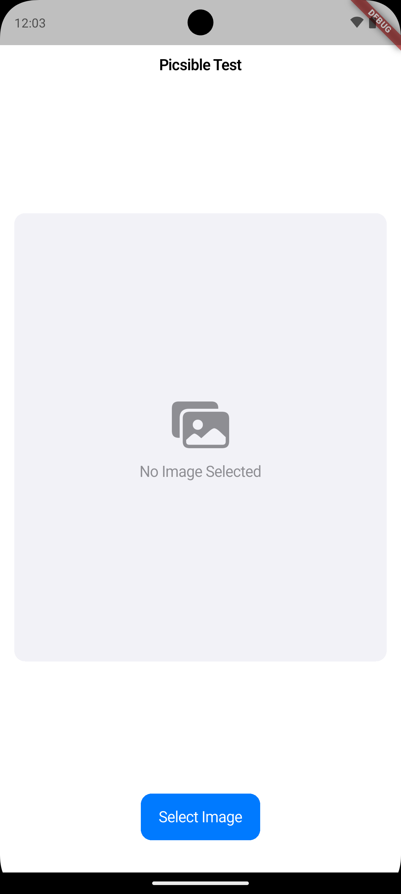
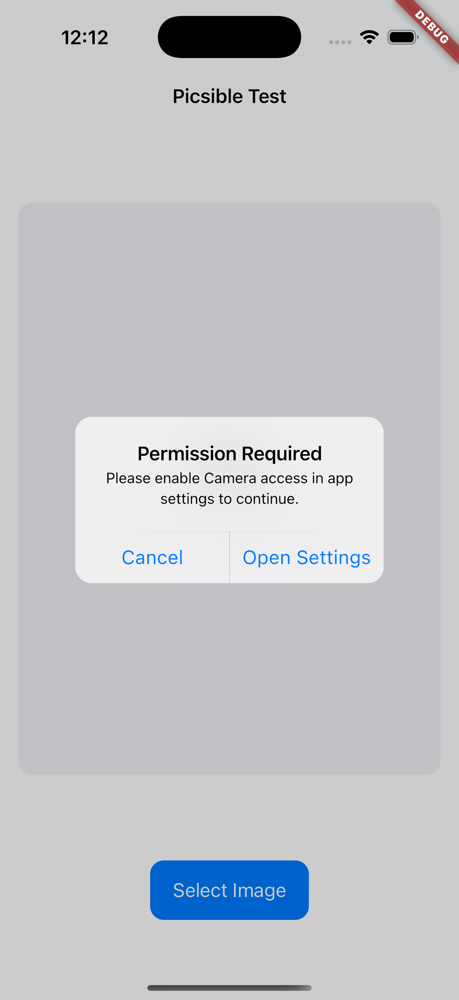
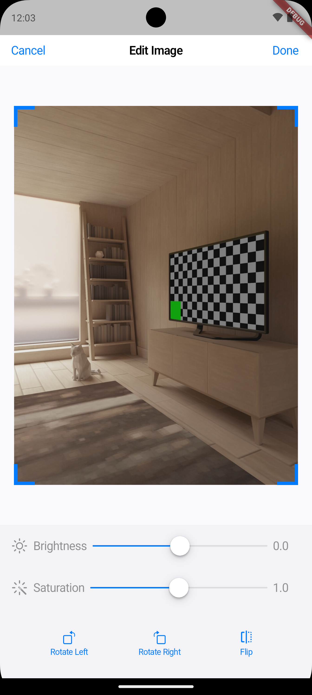
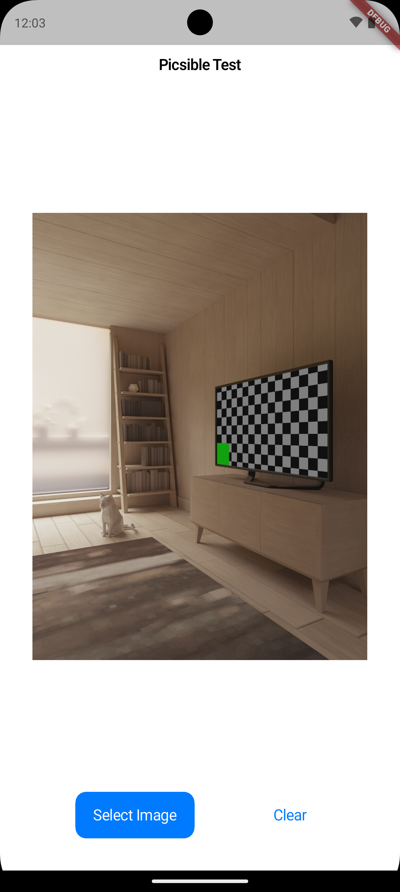
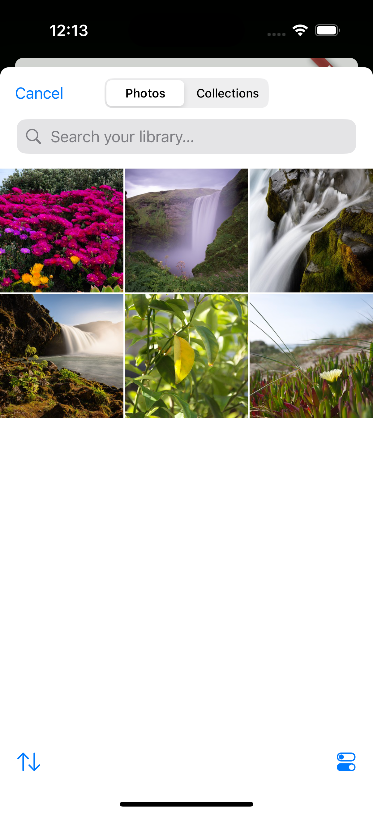
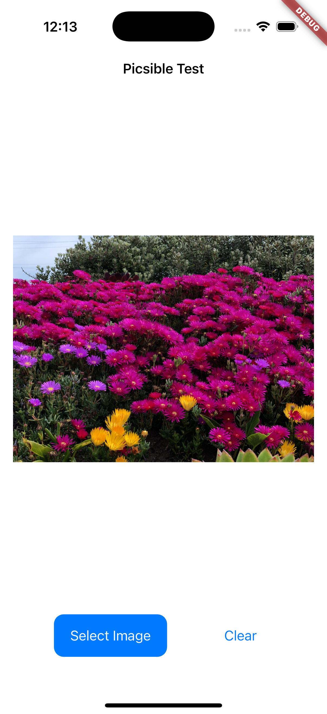

# Picsible Test

This is a test by Picsible to build a Flutter-based mobile application that allows users to capture, select, and edit images with various enhancement features. The app provides a clean, intuitive interface for image manipulation with iOS-style design elements.

💡 **Pro Tip**: Try long-pressing or double-tapping the "Select Image" button to unlock additional editing features! These gestures reveal advanced tools for professional-grade image enhancements and creative filters.

## Screenshots

<table>
    <tr>
        <td></td>
        <td></td>
        <td></td>
        <td></td>
        <td></td>
        <td></td>
    </tr>
</table>

## Features

- Image capture using device camera
- Image selection from gallery
- Image editing capabilities:
  - Crop
  - Rotate
  - Flip
  - Adjust brightness
  - Adjust contrast
  - Adjust saturation
- Permission handling for camera and storage access
- iOS-style UI with CupertinoDesign

## Usage

1. Launch the app
2. Tap "Select Image" to either:
   - Take a new photo using the camera
   - Select an existing photo from the gallery
3. Use the editing tools to enhance your image:
   - Adjust brightness, contrast, and saturation using sliders
   - Crop the image using the crop tool
   - Rotate or flip the image as needed
4. Save your edited image

## Prerequisites

Before you begin, ensure you have the following installed:

- [Flutter SDK](https://flutter.dev/docs/get-started/install) (SDK version ^3.7.0)
- [Dart](https://dart.dev/get-dart)
- iOS development tools (for iOS development)
- Android development tools (for Android development)

## Dependencies

The project uses the following main dependencies:

- `cupertino_icons: ^1.0.8` - iOS-style icons
- `extended_image: ^10.0.1` - Advanced image handling
- `flutter_svg: ^2.1.0` - SVG rendering support
- `image_editor: ^1.6.0` - Image editing capabilities
- `image_picker: ^1.1.2` - Image selection and capture
- `permission_handler: ^12.0.0+1` - Device permission management

## Getting Started

1. Clone the repository:

   ```bash
   git clone <repository-url>
   cd picsible
   ```

2. Install dependencies:

   ```bash
   flutter pub get
   ```

3. Run the app:
   ```bash
   flutter run
   ```

## Platform-Specific Setup

### iOS

1. Open `ios/Runner.xcworkspace` in Xcode
2. Configure signing in Xcode under Runner target settings
3. Add the following keys to `ios/Runner/Info.plist`:
   ```xml
   <key>NSCameraUsageDescription</key>
   <string>This app needs camera access to take photos</string>
   <key>NSPhotoLibraryUsageDescription</key>
   <string>This app needs photos access to select images</string>
   ```

### Android

1. Ensure you have the latest Android SDK installed
2. The app requires the following permissions in `android/app/src/main/AndroidManifest.xml`:
   ```xml
   <uses-permission android:name="android.permission.CAMERA" />
   <uses-permission android:name="android.permission.READ_EXTERNAL_STORAGE" />
   <uses-permission android:name="android.permission.WRITE_EXTERNAL_STORAGE" />
   ```

## License

This project is licensed under the MIT License - see the LICENSE file for details.
